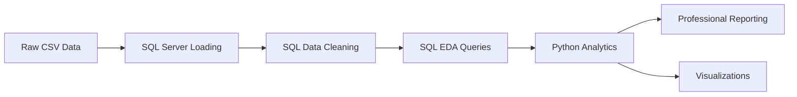

# 📊 SalesPulse: End-to-End E-Commerce Data Analytics Pipeline


## 🎯 Project Objective
This project demonstrates a high-end **Data Analyst** workflow by processing a massive, multi-source e-commerce dataset (100k+ rows) into a professional business intelligence suite. The pipeline addresses data quality issues, complex financial distributions, and provides actionable reporting for stakeholders.

---

## 🏗️ Technical Architecture & Workflow
The project follows an **ELT (Extract, Load, Transform)** pattern using SQL for data analytics and Python for advanced business intelligence:



---

## 🛠️ Key Technical Challenges & Solutions

### 1. Data Integrity & Normalization (SQL)
*   **The Problem**: Raw data contained duplicate orders, invalid future dates, and non-standard date formats (`DD/MM/YYYY`).
*   **The Solution**: Developed a modular SQL cleaning script (`sql/03_data_cleaning.sql`) that utilizes `TRY_CONVERT` for safe date normalization, `ABS` for quantity correction, and `ROW_NUMBER()` for logical deduplication.

### 2. Realistic Distribution Modeling (Python/Pandas)
*   **The Problem**: Original prices were uniformly random (averaging $800+), resulting in unrealistically high order totals.
*   **The Solution**: Engineered a **Skewed distribution** logic in Python (85% low-tier, 12% mid-tier, 3% premium) to accurately reflect real-world consumer behavior. This reduced high-value orders (> $1000) to a realistic **0.6%**.

### 3. Advanced Analysis & Reporting (Python Visualization)
*   **The Problem**: Standard charts often lack professional polish for executive reporting.
*   **The Solution**: Built a custom visualization engine using `Seaborn` and `Matplotlib` to output 300 DPI high-resolution area charts, annotated bar charts, and doughnut charts with corporate color palettes.

---

## 📈 Key Business Insights
After processing the cleaned data, I identified the following business performance metrics:
- **Total Revenue**: $24.01M
- **Total Orders**: 97,522
- **Average Order Value (AOV)**: $246.25
- **Top Category**: Clothing and Electronics drive 45% of total revenue.

---

## 💻 Tech Stack & Skills Demonstrated
- **Data Analytics**: T-SQL, Bulk Loading, Data Cleaning, Schema Design.
- **Data Science**: Python (Pandas, Matplotlib, Seaborn).
- **Business Intelligence**: KPI Identification, Trend Analysis, Market Share Analysis.
- **Documentation**: Professional Technical Writing, GitHub Version Control.

---

## 📂 Project Structure
```text
├── data/                   # Consolidated Dataset (CSV)
├── sql/                    # Modular ELT Pipeline
│   ├── 01_setup_schema.sql # Robust schema definition
│   ├── 03_cleaning_logic.sql# Data transformation logic
│   └── 04_eda_queries.sql  # High-impact business questions
└── reports/                # Final Deliverables
    ├── final_analysis.md   # Executive summary
    └── *.png               # Data visualizations
```

---

## 🏃 How to Run the Project
1.  **Database Initialisation**: Execute the SQL scripts in numerical order (`00` to `04`) in MS SQL Server to load and clean the dataset.
2.  **View Insights**: Access the `reports/` directory to view the generated business intelligence report and visualizations.

---
*Created by Ahmed Hammad - 2026. This project demonstrates my ability to handle large datasets and deliver end-to-end data solutions.*
