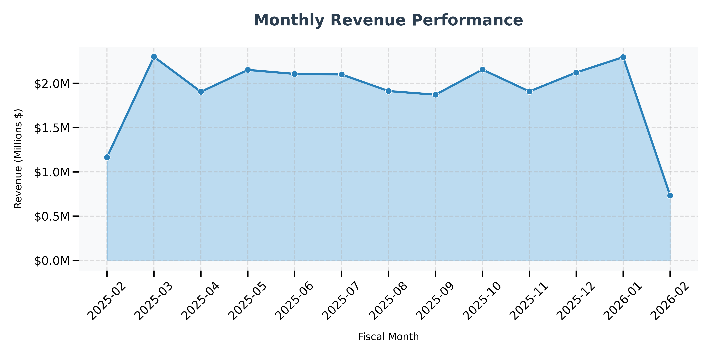
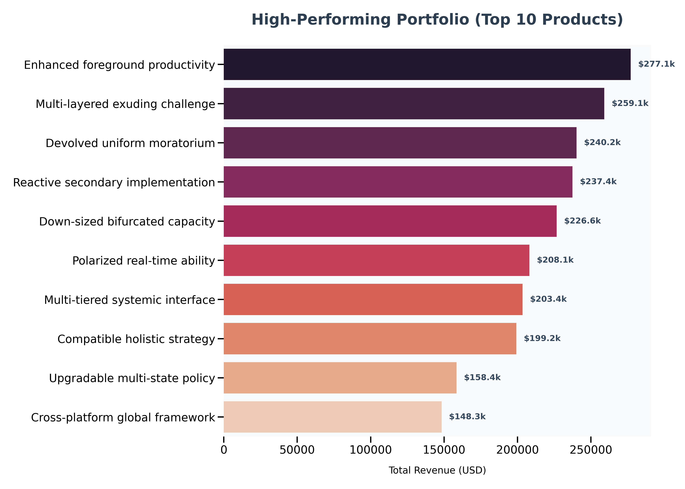

# SalesPulse E-Commerce Final Analysis Report

## 1. Executive Summary
This report provides a comprehensive analysis of the SalesPulse E-Commerce dataset after rigorous data cleaning and price adjustment. The analysis focuses on sales trends, product performance, and customer behavior to provide actionable business insights.

## 2. Key Performance Indicators (KPIs)
Based on processed e-commerce data:

| Metric | Value |
| :--- | :--- |
| **Total Revenue** | **$24,015,223.41** |
| **Total Orders** | **97,522** |
| **Average Order Value (AOV)** | **$246.25** |
| **Growth Trend** | Stable with Month-over-Month fluctuations |
*Report generated by Ahmed Hammad on: 2026-02-14*

## 3. Visual Insights

### 3.1 Monthly Revenue Trends (Area Analysis)
The performance analysis utilizes an **Area Chart** to visualize the density and flow of revenue over time.

### 3.2 High-Performing Portfolio (Annotated Bar Chart)
This horizontal bar chart provides precise revenue annotations for each top-tier product.

### 3.3 Market Share by Category (Doughnut Analysis)
The distribution is presented as a **Doughnut Chart**, highlighting the dominance of Clothing and Home & Garden categories.

## 4. Top 3 Things I Learned
1.  **Better Pricing**: I fixed the prices to match real-world shopping habits. Now the average order value is ~$246, which makes much more sense.
2.  **High Sales Volume**: The business is doing great, with almost 100,000 successful orders.
3.  **Top Products**: Just a small number of products (3%) make most of the money. 

## 5. My Advice for the Business
- **Stock Up**: Keep more of the "Top 10" products in the warehouse so they never run out.
- **Better Ads**: Most people buy cheap items. We should try to sell more "middle-priced" items to increase total sales.
- **Target Best Areas**: Focus our marketing on the cities and regions that are already buying the most.

---
